# How to Create a New Job

Status: Not started

Transform your hiring process with Fabric's AI-powered recruitment. This guide walks you through creating compelling job listings that attract top talent and streamline your screening process.

<aside>
⚡

Quickly access the different steps in this guide:

- [**Step 1: Upload Job Description**](https://www.notion.so/How-to-Create-a-New-Job-2147635a3d9b80449f68ed10302058c3?pvs=21)
- [**Step 2: Skills and Requirements**](https://www.notion.so/How-to-Create-a-New-Job-2147635a3d9b80449f68ed10302058c3?pvs=21)
- [**Step 3: Conversation Flow**](https://www.notion.so/How-to-Create-a-New-Job-2147635a3d9b80449f68ed10302058c3?pvs=21)
- [**Step 4: Role Information**](https://www.notion.so/How-to-Create-a-New-Job-2147635a3d9b80449f68ed10302058c3?pvs=21)
- [**Step 5: Pre-Interview Questions**](https://www.notion.so/How-to-Create-a-New-Job-2147635a3d9b80449f68ed10302058c3?pvs=21)
- [**Step 6: Launch and Share**](https://www.notion.so/How-to-Create-a-New-Job-2147635a3d9b80449f68ed10302058c3?pvs=21)
</aside>

Getting started with Fabric is straightforward. Navigate to your Fabric dashboard and select **Create a New Job** to begin setting up your interview process.

---

# **Step 1:** Upload Job Description

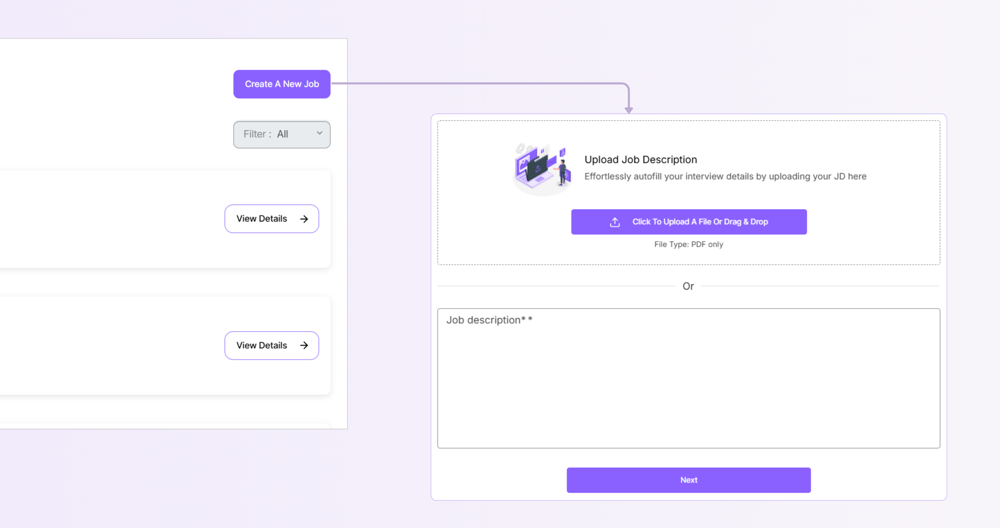

Fabric makes it easy to get your job requirements into the system with two flexible options:

- **Option 1: File Upload**
    
    Upload your job description as a PDF file directly.
    
- **Option 2: Copy and Paste**
    
    Copy your existing job description and paste it into the designated text field for quick setup.
    

Once submitted, Fabric's AI works its magic, processing your job description within seconds and automatically extracting essential details, such as required qualifications, preferred skills, experience levels, and other relevant criteria.

<aside>
💡

A **well-defined job description** is your foundation for success. Clear, specific requirements help Fabric's AI accurately extract and process key details, which translates directly into better candidate matching and more targeted interviews.

</aside>

---

# Step 2: **Skills and Requirements**

This is where you'll fine-tune what matters most for your role.

## Fundamental Skills

This section displays all the core skills an ideal candidate should possess. You'll notice that skills are marked with either a **Purple star (Must Have)** or appear in **grey (Good to Have)**. You can easily toggle between these categories by clicking the star icon.

.png)

### **Must Have Skills**

These are your non-negotiables. Candidates lacking these skills will be automatically rejected, so choose wisely. We recommend limiting this to your top 5-6 most critical skills. Think of these as the capabilities someone needs to be effective from day one.

### **Good to Have Skills**

These are the "nice-to-have" secondary skills that would strengthen a candidate's profile but won't make or break their application. This gives you flexibility while maintaining your core standards.

### ℹ️ When adding skills and requirements

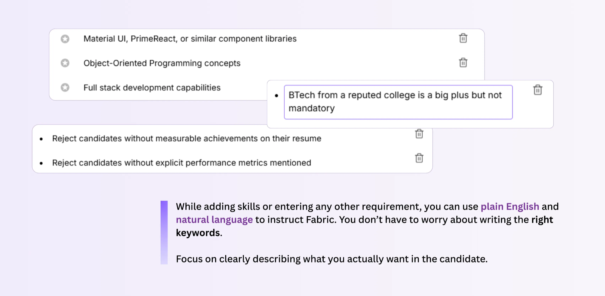

## Critical Sections

These sections define deal-breaker requirements.

### Desired Work Experience

Set the experience parameters that align with your role's complexity and responsibilities.

This section becomes especially useful when you want candidates to have specific work experience history, such as industry preferences, company types, and the type of work the candidate has done in previous roles.

### Education Requirements

.png)

- **College Requirements:** If you recruit only from certain colleges, then you can add them to the list here. Fabric's resume screening will check a candidate's college against your list, and only candidates from the right colleges will clear the resume round.
- **Degree Requirements:** If your job has certain degree requirements, then you can add them to the list here. Fabric's resume screening will check a candidate's degree against your list, and only candidates with the right degrees will clear the resume round.
- **Certifications:** List professional credentials, licenses, or industry-recognized certifications that validate the expertise you need.

### Red Flags

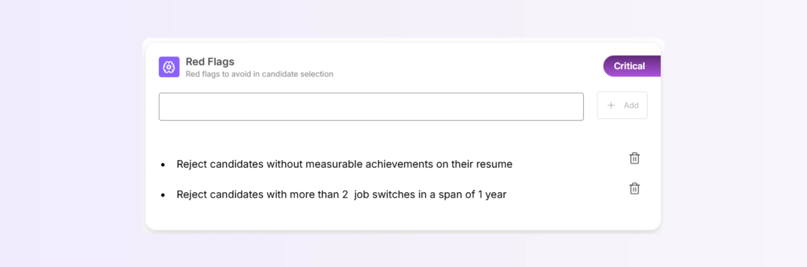

Identify specific patterns that might indicate concerns about candidate suitability. Common examples include frequent job changes (e.g., multiple role changes within 2-year periods), a profile/background that you specifically don’t want, or the lack of a certain skill that is most important for you.

---

# Step 3: Conversation Flow

This is the step where you configure your AI Interview Assistant and the questions the assistant will ask the candidates. Let’s get started!

## **Quick Select Assistants**

Choose the AI personality that will represent your company during interviews. Fabric offers regional optimization to ensure candidates feel comfortable and understood.

**Popular Options:**

- "**Anushka**" and "**Shubham**" for Indian English
- "**Rachel**" for US accent English
- "**Paula**" for Australian accent English

Fabric supports 50+ languages and 200+ accents. If your preferred language or accent isn't listed above, simply reach out to **av@fabrichq.ai** for a custom recruiter personality tailored to your needs.

## Resume-based Questions

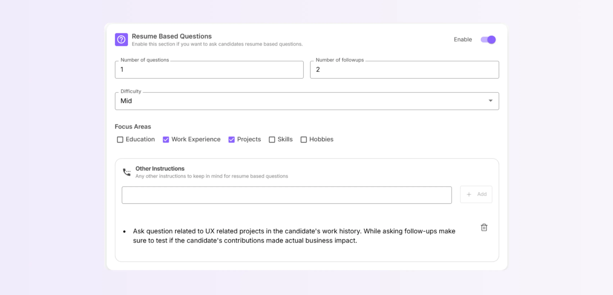

These are dynamically generated questions that dive into specific experiences, skills, and projects mentioned in each candidate's resume. You can set different focus areas from the resume, like Education, Work Experience, to use as context while asking these questions. You can also add Additional Instructions to add more context and specificity to your questions.  This personalized approach ensures every interview feels relevant and targeted.

## Must Ask Questions

Fabric's AI auto-generates a list of 5 questions based on your job description and must-have skills. These questions are based on our extensive AI research on what types of questions lead to better candidate evaluation.

.png)

These questions ensure every candidate is assessed consistently across the same critical competencies, technical skills, and role-specific challenges.

You get the option to customize all the questions or simply add your own.

.png)

### **Question Framework:**

Each Must-Ask Question follows a comprehensive structure designed for thorough evaluation:

- **Question:** The specific scenario or challenge presented to the candidate
- **Difficulty:** Complexity level indicated by an easy-to-read colored ribbon system
- **Skills Being Tested:** The specific competencies being evaluated
- **Number of Follow-ups:** Additional probing questions generated dynamically based on the candidate's responses
- **Purpose:** The strategic reasoning behind including this question
- **Follow-up Directions:** Guidance for the AI Assistant on how to probe deeper
- **Expected Answer:** Benchmarks that indicate strong candidate performance

In most of the above fields, you can simply write your instructions in plain English, similar to how you would do in a prompt.

### **Customization options:**

- **Regenerate:** Let AI create alternative questions while maintaining the same assessment goals
- **Add/Delete:** Add your own questions or delete existing questions
- To add a question,
    - Click the **+** **Add Question** button, and a new empty question field will appear
    - Enter the question and click the **Reload 🔄** button next to the question
    - All other fields will be generated and auto-filled by Fabric’s AI
- **Edit:** Click any question field and simply edit the question as you please, then click the **Reload 🔄** button to generate and auto-fill all the other fields in the question structure

## Additional Sections

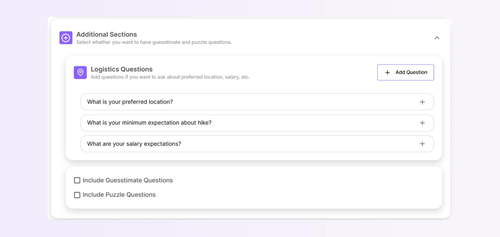

### **Logistic Questions**

Questions that cover the practical details, like availability, notice periods, and salary expectations that affect hiring decisions. These questions will be asked by the assistant right after all the Must-Ask Questions and Guesstimate/Puzzle Questions.

<aside>
ℹ️

Logistic Questions will NOT be used for evaluation purposes; the answers from the candidate will simply be stored for your review.

</aside>

### **Guesstimate Questions**

Perfect for analytical roles, these collaborative problem-solving sessions let candidates work through complex scenarios in real-time with the AI interviewer.

When you turn on Guesstimate questions, Fabric shows you its question bank from which one question will be asked randomly. You can also add your own questions here.

### **Puzzle Questions**

Designed for creative problem-solving assessments that reveal how candidates think through challenges.

When you turn on Puzzle questions, Fabric shows you its question bank from which one question will be asked randomly. You can also add your own questions here.

<aside>
💡

Configure the questions as you like. Combinations like 1 Resume Question, 3 Must-Ask Questions, and 1 Guesstimate work well, or go ahead with just the Must-Ask Questions. 

Use the combination that you think will work best for the job role and the candidates.

</aside>

## **Assistant Details and Settings**

Fine-tune your AI interviewer's behavior and presentation:

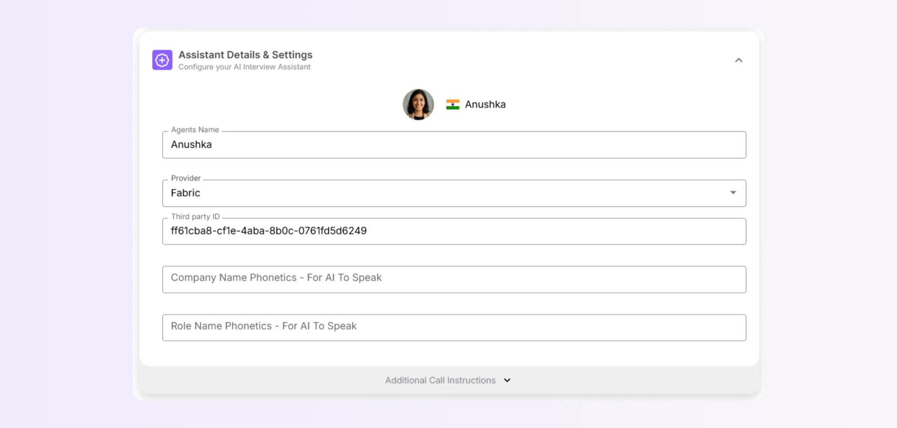

- **Agent Name:** Customize the assistant's name to better reflect your company culture
- **Provider & Third Party ID:** Technical integration settings. We recommend that you leave these settings as they are.
- **Company Name Phonetics:** Ensure your company name is pronounced correctly (e.g., spell out "SAP" as "S-A-P" to avoid the AI saying "Sapee")
- **Role Name Phonetics:** Similar pronunciation guidance for role titles

Most Fabric interviews follow a certain conversation flow. But if you want to change or customize the conversation flow, click the **Additional Call Instructions** button and use the following options:

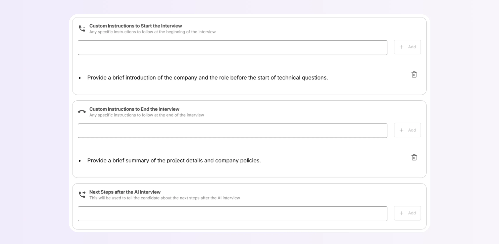

- **Custom Start Instructions:** Add specific opening requirements. For example, if you want the AI to talk about your company and the role at the beginning instead of the end of the interview, you can mention it here.
- **Custom End Instructions:** Similarly, if you want to change how the conversations end, you can include closing information. This might include custom prompts about company policies, office locations, or next steps.
- **Next Steps Communication:** Often, candidates are curious to know about your interview process or how soon they can expect to hear back from you. You can add custom instructions about your process in this section.

---

# Step 4: Role Information

Define the essential details that frame your job. The details in this section (except salary range) will be visible to the candidates while they apply for the job.

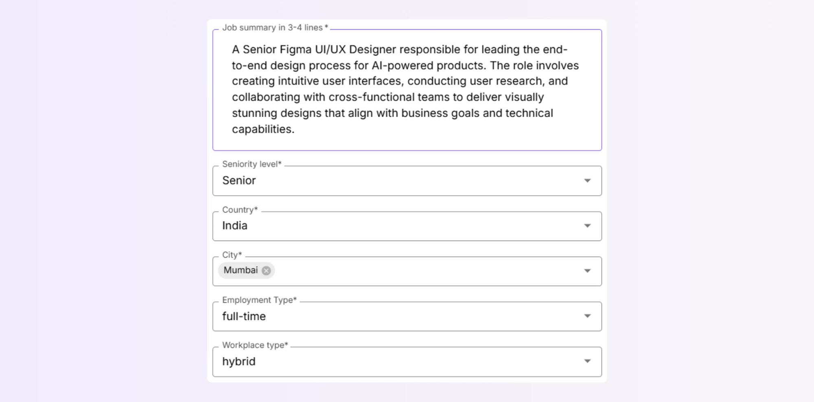

- **Role Name:** The official position title
- **Job Summary:** A concise 3-4 line overview that captures the role's purpose, key objectives, and success metrics
- **Seniority Level:** Where this position sits in your organizational hierarchy
- **Location:** Country and city details (multiple cities can be selected for the same role)
- **Employment Type:** Full-time, part-time, contract, or other arrangements
- **Workplace Type:** In-office, remote, or hybrid work structure

## Eligibility Toggles

When you want to screen candidates based on their years of experience and/or salary expectations, the eligibility toggles become useful in such cases.

.png)

### **Years of Experience**

Set the minimum/maximum experience range using the slider.

When the toggle is enabled, candidates below the minimum required years of experience are automatically rejected.

### **Salary Range**

Set minimum/maximum salary for the role using the slider.

When the toggle is enabled, candidates with an expected salary above your maximum range are automatically rejected.

**Currency:** Enter the currency you want to use for the salary.

<aside>
ℹ️

Salary Range will NOT be visible to the candidates.

</aside>

### **Responsibilities**

Core duties and accountabilities that define the role's scope.

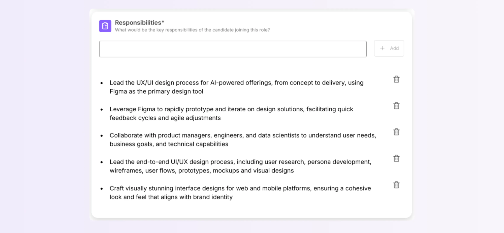

---

# **Step 5: Pre-Interview Questions**

Fabric provides the option to add questions to help you know the candidates better. These questions are asked in a form format at the end of the application process. Select question types like MCQ, Yes/No, Number (when response is required in numeric format), and Free text.

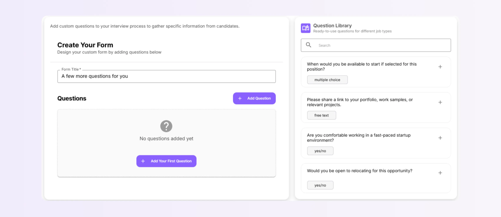

### Question Library

A curated collection of popular, tried-and-tested questions that can be instantly added to your application flow, saving you time.

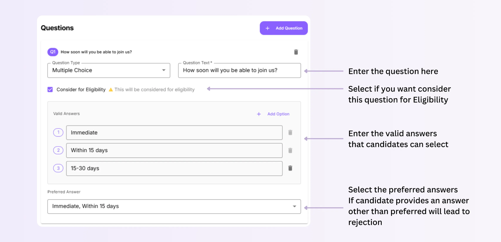

Pre-Interview Questions can also serve as additional eligibility filters, which can be toggled by clicking the **Consider for Eligibility** button corresponding to the question:

- "How soon will you be able to join us?" (with your acceptable range)
- "Are you open to relocation?" (essential for location-specific roles)
- "Can you share your portfolio link?" (for creative roles)

---

# Step 6: Launch and Share

Once everything looks good, **FINISH** your job listing. Fabric generates a shareable link for multi-channel distribution.

- Post on LinkedIn or other job portals.
- Share directly with candidates via email.

Fabric also supports Bulk Upload of Resumes, thus enabling the upload of an existing pool of candidates into Fabric AI for screening and AI Interviews. 

---

# Wrapping Up

That’s it! Your job role and AI Interview assistant have now been created! 

As candidates apply to your job role, Fabric uses a specialized scoring framework to evaluate candidate resumes and subsequently the AI Interview. A scoring structure (out of 10) is used for assessments.

<aside>
💡

By default, Fabric has set the Resume Screening Score and AI Interview Assessment Score to 7.

</aside>

You can easily change the score to a higher or lower value by clicking the **Edit Job** button and navigating to Screening Criteria. 

> Know more about how to edit a job and other settings by clicking the link below:
> 

[How to Edit a Job](https://www.notion.so/How-to-Edit-a-Job-2617635a3d9b80399e3fcd50cdd07d2d?pvs=21)

---
